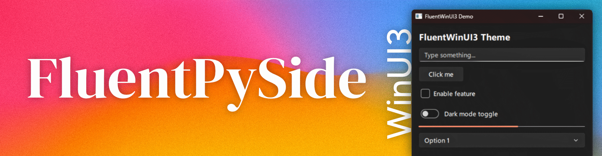

<p align="center">
  
</p>

FluentPySide
===========

[](https://pypi.org/project/fluentpyside/)

fluentpyside packages the FluentWinUI3 Qt Quick Controls style so any Qt / PySide6 application can add the FluentWinUI3 theme easily.
The goal is to make it simple to enable the Fluent theme without bundling the full PySide6 runtime into your application. For minimal, bloat-free builds prefer installing PySide6-Essentials on the target system rather than packaging compiled plugin binaries inside this package.

> **⚠️ IMPORTANT — Read this before using**
>
> This library is a **QML visual theme only**. It styles Qt Quick Controls 2 components (Button, TextField, CheckBox, etc.) to look like Windows 11's Fluent Design. It does **NOT** provide:
>
> - A Python widget library (it does NOT touch `QtWidgets` — no `QPushButton`, `QLabel`, etc.)
> - A color/theme singleton called `Fluent` (there is no `Fluent.backgroundColor`, `Fluent.accentColor`, etc.)
> - Custom QML components — you use the **standard** Qt Quick Controls 2 API, this library just changes how they look
>
> If you need colors in your QML, define them yourself:
> ```qml
> // ✅ Correct — use standard QML properties
> Rectangle {
>     color: "#f3f3f3"  // WinUI 3 light background
> }
>
> // ❌ WRONG — "Fluent" does NOT exist
> Rectangle {
>     color: Fluent.backgroundColor  // ReferenceError: Fluent is not defined
> }
> ```

Quick Start
-----------

```sh
pip install PySide6-Essentials   # recommended — provides the runtime plugins
pip install fluentpyside
```

```py
import fluentpyside
fluentpyside.apply()
```

That's it. `apply()` registers the FluentWinUI3 QML import path and sets the QtQuickControls2 style to `FluentWinUI3`. After that, any standard Qt Quick Controls 2 component in your QML will be rendered with the Fluent theme automatically.

### How it works

You write **standard QML** using the normal Qt Quick Controls 2 imports. The `fluentpyside.apply()` call sets the style, so every component automatically gets the Fluent look — you don't import anything special, you don't reference any theme object, you just write normal QML.

```py
# main.py
from PySide6.QtGui import QGuiApplication
from PySide6.QtQml import QQmlApplicationEngine
import fluentpyside

app = QGuiApplication([])
engine = QQmlApplicationEngine()

# ONE line — this is all you need
fluentpyside.apply()

engine.load("main.qml")
app.exec()
```

```qml
// main.qml
// NOTE: Only standard Qt imports — NO Fluent-specific import needed
import QtQuick
import QtQuick.Controls
import QtQuick.Layouts

ApplicationWindow {
    visible: true
    width: 400
    height: 300
    title: "FluentWinUI3 Demo"

    ColumnLayout {
        anchors.fill: parent
        anchors.margins: 16
        spacing: 12

        Label {
            text: "FluentWinUI3 Theme"
            font.pixelSize: 20
            font.bold: true
        }

        TextField {
            placeholderText: "Type something..."
            Layout.fillWidth: true
        }

        Button {
            text: "Click me"
            onClicked: console.log("Button clicked!")
        }

        CheckBox {
            text: "Enable feature"
        }

        Switch {
            text: "Dark mode toggle"
        }

        ProgressBar {
            value: 0.6
            Layout.fillWidth: true
        }

        ComboBox {
            model: ["Option 1", "Option 2", "Option 3"]
            Layout.fillWidth: true
        }

        Item { Layout.fillHeight: true }
    }
}
```

Available styled components
---------------------------

These **standard Qt Quick Controls 2** components get Fluent styling automatically when `fluentpyside.apply()` is called:

| Component | Notes |
|---|---|
| `ApplicationWindow` | Main window container |
| `Button` | Standard push button |
| `RoundButton` | Circular/pill-shaped button |
| `DelayButton` | Button that activates after holding |
| `ToolButton` | Toolbar button |
| `TextField` | Single-line text input |
| `TextArea` | Multi-line text input |
| `SearchField` | Text input with search icon (Qt 6.10+) |
| `SpinBox` | Numeric input with up/down arrows |
| `ComboBox` | Dropdown selector |
| `CheckBox` | Checkbox with label |
| `CheckDelegate` | Checkbox in a list item |
| `RadioButton` | Radio button with label |
| `RadioDelegate` | Radio button in a list item |
| `Switch` | Toggle switch |
| `SwitchDelegate` | Toggle switch in a list item |
| `Slider` | Horizontal slider |
| `RangeSlider` | Two-handle slider |
| `ProgressBar` | Linear progress indicator |
| `BusyIndicator` | Spinning loading indicator |
| `PageIndicator` | Dot-style page indicator |
| `GroupBox` | Labeled container frame |
| `Frame` | Container frame |
| `ScrollView` | Scrollable area (falls back to system) |
| `TabBar` / `TabButton` | Tab navigation |
| `ToolBar` | Toolbar container |
| `ToolSeparator` | Separator for toolbars |
| `MenuBar` / `MenuBarItem` | Top menu bar |
| `Menu` / `MenuItem` / `MenuSeparator` | Dropdown menus |
| `Dialog` / `DialogButtonBox` | Modal dialogs |
| `Popup` | Generic popup container |
| `ToolTip` | Hover tooltip |
| `ItemDelegate` | Clickable list item |
| `SwipeDelegate` | Swipeable list item |

### NOT styled (will fall back to system/default Qt style)

| Component | Reason |
|---|---|
| `Dial` | Not implemented by upstream FluentWinUI3 |
| `Drawer` | Not implemented by upstream FluentWinUI3 |
| `SplitView` | Not implemented by upstream FluentWinUI3 |
| `StackView` | Not implemented by upstream FluentWinUI3 |
| `SwipeView` | Not implemented by upstream FluentWinUI3 |
| `TreeView` | Not implemented by upstream FluentWinUI3 |
| `Tumbler` | Not implemented by upstream FluentWinUI3 |
| `Label` | Plain text — no styling needed, uses default |

Requirements
------------

- Python 3.8+
- PySide6-Essentials (recommended) or PySide6 — provides the Qt runtime plugins needed at runtime. This package only ships the QML styling files (no compiled plugin binaries), keeping the wheel small and cross-platform.

Public API reference
--------------------

### `fluentpyside.apply() -> str`

One-liner to enable the FluentWinUI3 theme. Call this **before** loading any QML. Returns the path used for the style.

```py
import fluentpyside
fluentpyside.apply()  # call BEFORE engine.load()
```

### `fluentpyside.set_style(engine=None, path=None) -> str`

Lower-level API if you need fine-grained control. Sets the QML import path and Qt Quick Controls 2 style.

```py
engine = QQmlApplicationEngine()
style_path = fluentpyside.set_style(engine=engine)
engine.load("main.qml")
```

### `fluentpyside.install_assets(target_dir)`

Copy the FluentWinUI3 QML tree into a target project directory. Useful for vendoring the theme files.

```sh
python -m fluentpyside --install /path/to/your/project
```

### `fluentpyside.find_installed_style() -> Optional[Path]`

Search for the FluentWinUI3 style in the installed PySide6 package. Returns `None` if not found.

### `fluentpyside.default_style_path() -> Path`

Return the package-local style path (inside the fluentpyside wheel).

Common mistakes
---------------

### ❌ "ReferenceError: Fluent is not defined"

This library does **not** provide a `Fluent` singleton. There is no `Fluent.backgroundColor`, `Fluent.accentColor`, `Fluent.primaryColor`, etc.

If you need colors, define them in your own QML:

```qml
Item {
    // Define your own color constants
    readonly property color bgColor: "#f3f3f3"
    readonly property color accentColor: "#005fb8"
    readonly property color textColor: "#1a1a1a"

    Rectangle {
        color: bgColor  // ✅ use your own properties
    }
}
```

Or use `SystemPalette` / `Application.styleHints`:

```qml
Label {
    color: SystemPalette.text  // follows system colors
}
```

### ❌ Using Qt Widgets instead of Qt Quick

This library styles **Qt Quick Controls 2 (QML) only**. It does nothing for classic Qt Widgets:

```py
# ❌ These are Qt Widgets — NOT styled by fluentpyside
from PySide6.QtWidgets import QPushButton, QLabel, QMainWindow

# ✅ Use QML with PySide6 — this IS styled
from PySide6.QtQml import QQmlApplicationEngine
```

### ❌ Calling `apply()` after loading QML

`fluentpyside.apply()` must be called **before** `engine.load()`:

```py
engine = QQmlApplicationEngine()
fluentpyside.apply()  # ✅ BEFORE
engine.load("main.qml")

# NOT:
# engine.load("main.qml")  # ❌ too late
# fluentpyside.apply()
```

### ❌ Forgetting PySide6-Essentials

This package only ships QML files. You need PySide6 installed for the runtime:

```sh
pip install PySide6-Essentials  # or PySide6 (full)
pip install fluentpyside
```

Updating the theme in a project
-------------------------------

If you want to copy the FluentWinUI3 QML tree into a target project manually:

```sh
python tools/update_theme.py /path/to/your/project
```

This copies `FluentWinUI3/` into `/path/to/your/project/QtQuick/Controls/FluentWinUI3/` so you can add the project root as a QML import path.

License
-------

- Wrapper: MIT License (file LICENSE)
- Upstream QML assets: copied from the locally installed PySide6 / PySide6-Essentials package. Follow Qt/PySide licensing when redistributing.
